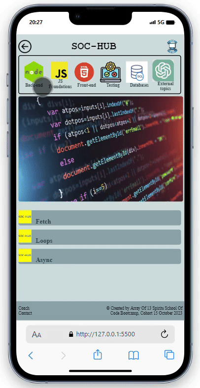

<h1 align="center" id="title">SOC HUB</h1>

Project Description: In a team of five we undertook a one-week challenge at The School of Code bootcamp. Our mission was to pinpoint a problem affecting fellow bootcampers and develop a full-stack application as a solution. After thorough problem discovery and user research we identified a common struggle: accessing resources provided by coaches. These valuable materials were dispersed and hard to locate within the Slack general thread.  In response we employed Disney Ideation techniques to conceptualize a single-page web application. This application aimed to efficiently organize coach-provided resources by topic with an envisioned feature allowing users to contribute additional resources. Our Minimum Viable Product (MVP) successfully materialized encompassing resource retrieval organized by topic. Unfortunately due to time constraints we couldn't implement the "add a resource" functionality.  For the project's technical implementation we utilized HTML CSS and JavaScript for the front-end. On the backend we employed JavaScript and Elephant SQL for our database complemented by Playwright for end-to-end testing. The result was a streamlined solution addressing the challenge faced by bootcampers in accessing and organizing resources.  As a stretch goal we aimed to introduce a feature enabling coaches to offer one-on-one or group coaching sessions enhancing the overall learning experience for bootcampers. While this feature remained aspirational our project laid the groundwork for future improvements and expansion based on user needs and feedback.

<a href="https://github.com/PurpleNurps/SOC-HUB-back-end">Link to Back-End Repo</a>

<h2>🚀 Demo</h2>

